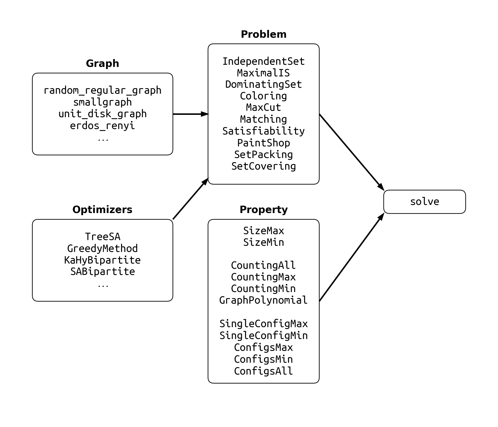

# GraphTensorNetworks

[](https://github.com/QuEraComputing/GraphTensorNetworks.jl/actions)
[](https://coveralls.io/github/QuEraComputing/GraphTensorNetworks.jl?branch=master)
[](https://psychic-meme-f4d866f8.pages.github.io/dev/)

## Installation
<p>
GraphTensorNetworks is a &nbsp;
    <a href="https://julialang.org">
        
        Julia Language
    </a>
    &nbsp; package. To install GraphTensorNetworks,
    please <a href="https://docs.julialang.org/en/v1/manual/getting-started/">open
    Julia's interactive session (known as REPL)</a> and press <kbd>]</kbd> key in the REPL to use the package mode, then type
</p>

```julia
pkg> add GraphTensorNetworks
```

To update, just type `up` in the package mode.

We recommend using **Julia version >= 1.7**, otherwise your program can suffer from significant (exponential in tensor dimension) overheads when permuting the dimensions of a large tensor.
If you have to use an older version Julia, you can overwrite the `LinearAlgebra.permutedims!` by adding the following patch to your own project.

```julia
# only required when your Julia version < 1.7
using TensorOperations, LinearAlgebra
function LinearAlgebra.permutedims!(C::Array{T,N}, A::StridedArray{T,N}, perm) where {T,N}
    if isbitstype(T)
        TensorOperations.tensorcopy!(A, ntuple(identity,N), C, perm)
    else
        invoke(permutedims!, Tuple{Any,AbstractArray,Any}, C, A, perm)
    end
end
```

## Examples

```julia
julia> using GraphTensorNetworks, Graphs

julia> # using CUDA

julia> solve(
           IndependentSet(
               Graphs.random_regular_graph(20, 3);
               optimizer = TreeSA(),
               weights = NoWeight(),
               openvertices = ()
           ),
           GraphPolynomial();
           usecuda=false
       )
0-dimensional Array{Polynomial{BigInt, :x}, 0}:
Polynomial(1 + 20*x + 160*x^2 + 659*x^3 + 1500*x^4 + 1883*x^5 + 1223*x^6 + 347*x^7 + 25*x^8)
```

Here the main function `solve` takes three inputs, the problem instance of type `IndependentSet`, the property instance of type `GraphPolynomial` and an optional key word argument `usecuda` to decide use GPU or not.
If one wants to use GPU to accelerate the computation, `using CUDA` must uncommented.
The problem instance takes four arguments to initialize, the only positional argument is the graph instance one wants to solve, the key word argument `optimizer` is for specifying the tensor network optimization algorithm, the key word argument `weights` is for specifying the weights of vertices as either a vector or `NoWeight()` and the keyword argument `openvertices` is for specifying the degrees of freedom not summed over.
Here, we use `TreeSA` method as the tensor network optimizer, and leave `weights` and `openvertices` the default values.
The `TreeSA` method performs the best in most of our applications.
The first execution of this function will be a bit slow due to Julia's just in time compiling.
After that, the subsequent runs will be fast.
The following diagram lists possible combinations of input arguments, where functions in the `Graph` are mainly defined in the package [Graphs](https://github.com/JuliaGraphs/Graphs.jl), and the rest can be found in this package.




You can find many examples in the [documentation](https://psychic-meme-f4d866f8.pages.github.io/dev/), a good one to start with is [solving the independent set problem](https://psychic-meme-f4d866f8.pages.github.io/dev/tutorials/IndependentSet/).

## Supporting and Citing

Much of the software in this ecosystem was developed as part of academic research.
If you would like to help support it, please star the repository as such metrics may help us secure funding in the future.
If you use our software as part of your research, teaching, or other activities, we would be grateful if you could cite our work.
The
[CITATION.bib](https://github.com/QuEraComputing/GraphTensorNetworks.jl/blob/master/CITATION.bib) file in the root of this repository lists the relevant papers.

## Questions and Contributions

You can
* Post a question on [Julia Discourse forum](https://discourse.julialang.org/), pin the package maintainer wih `@1115`.
* Discuss in the `#graphs` channel of the [Julia Slack](https://julialang.org/community/), ping the package maintainer with `@JinGuo Liu`.
* Open an [issue](https://github.com/QuEraComputing/GraphTensorNetworks.jl/issues) if you encounter any problems, or have any feature request.
