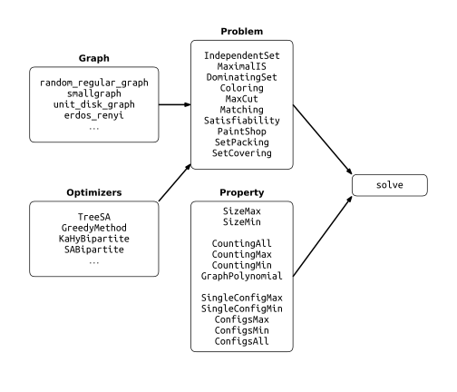

```@meta
CurrentModule = GenericTensorNetworks
```

# GenericTensorNetworks

This package implements generic tensor networks to compute *solution space properties* of a class of hard combinatorial problems.
The *solution space properties* include
* The maximum/minimum solution sizes,
* The number of solutions at certain sizes,
* The enumeration of solutions at certain sizes.
* The direct sampling of solutions at certain sizes.

The solvable problems include [Independent set problem](@ref), [Maximal independent set problem](@ref), [Spin-glass problem (Cutting problem)](@ref), [Vertex matching problem](@ref), [Binary paint shop problem](@ref), [Coloring problem](@ref), [Dominating set problem](@ref), [Satisfiability problem](@ref), [Set packing problem](@ref) and [Set covering problem](@ref).

## Background knowledge

Please check our paper ["Computing properties of independent sets by generic programming tensor networks"](https://arxiv.org/abs/2205.03718).
If you find our paper or software useful in your work, we would be grateful if you could cite our work. The [CITATION.bib](https://github.com/QuEraComputing/GenericTensorNetworks.jl/blob/master/CITATION.bib) file in the root of this repository lists the relevant papers.

## Quick start

You can find a set up guide in our [README](https://github.com/QuEraComputing/GenericTensorNetworks.jl).
To get started, open a Julia REPL and type the following code.

```julia
julia> using GenericTensorNetworks, Graphs

julia> # using CUDA

julia> solve(
           IndependentSet(
               Graphs.random_regular_graph(20, 3);
               optimizer = TreeSA(),
               weights = NoWeight(),    # default: uniform weight 1
               openvertices = (),       # default: no open vertices
               fixedvertices = Dict()   # default: no fixed vertices
           ),
           GraphPolynomial();
           usecuda=false              # the default value
       )
0-dimensional Array{Polynomial{BigInt, :x}, 0}:
Polynomial(1 + 20*x + 160*x^2 + 659*x^3 + 1500*x^4 + 1883*x^5 + 1223*x^6 + 347*x^7 + 25*x^8)
```

Here the main function [`solve`](@ref) takes three input arguments, the problem instance of type [`IndependentSet`](@ref), the property instance of type [`GraphPolynomial`](@ref) and an optional key word argument `usecuda` to decide use GPU or not.
If one wants to use GPU to accelerate the computation, the `using CUDA` statement must uncommented.

The problem instance takes four arguments to initialize, the only positional argument is the graph instance that one wants to solve, the key word argument `optimizer` is for specifying the tensor network optimization algorithm, the key word argument `weights` is for specifying the weights of vertices as either a vector or `NoWeight()`.
The keyword argument `openvertices` is a tuple of labels for specifying the degrees of freedom not summed over, and `fixedvertices` is a label-value dictionary for specifying the fixed values of the degree of freedoms.
Here, we use [`TreeSA`](@ref) method as the tensor network optimizer, and leave `weights` and `openvertices` the default values.
The [`TreeSA`](@ref) method finds the best contraction order in most of our applications, while the default [`GreedyMethod`](@ref) runs the fastest.

The first execution of this function will be a bit slow due to Julia's just in time compiling.
The subsequent runs will be fast.
The following diagram lists possible combinations of input arguments, where functions in the `Graph` are mainly defined in the package [Graphs](https://github.com/JuliaGraphs/Graphs.jl), and the rest can be found in this package.
```@raw html
<div align=center>

</div>
```⠀
You can find many examples in this documentation, a good one to start with is [Independent set problem](@ref).

