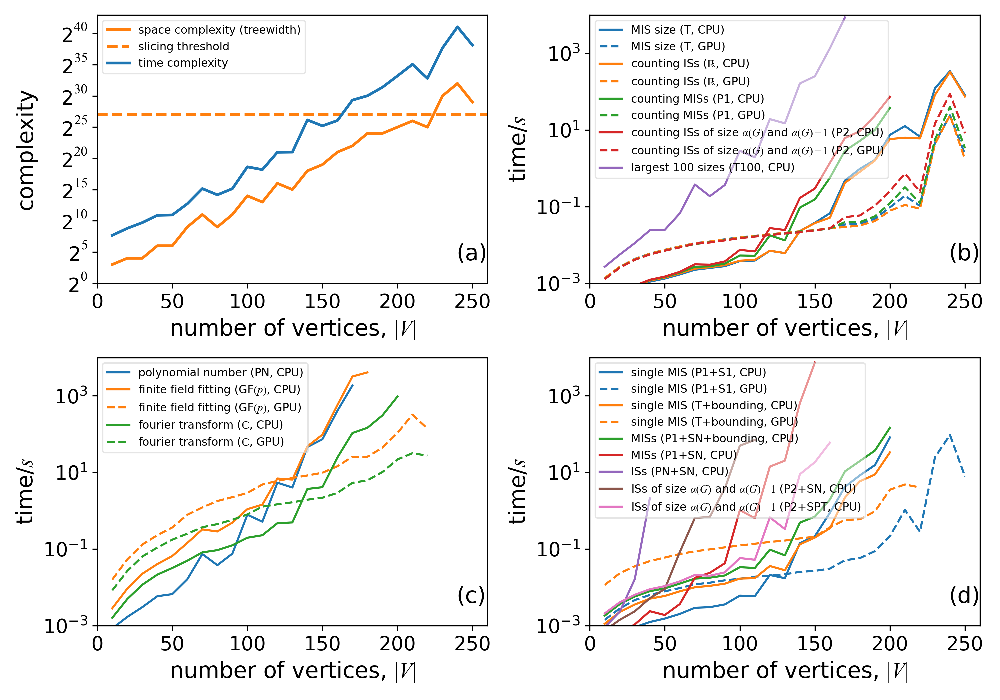

# Performance Tips
## Optimize contraction orders

Let us use the independent set problem on 3-regular graphs as an example.
```julia
julia> using GenericTensorNetworks, Graphs, Random

julia> graph = random_regular_graph(120, 3)
{120, 180} undirected simple Int64 graph

julia> problem = IndependentSet(graph; optimizer=TreeSA(
    sc_target=20, sc_weight=1.0, rw_weight=3.0, ntrials=10, βs=0.01:0.1:15.0, niters=20), simplifier=MergeGreedy());
```

The [`IndependentSet`](@ref) constructor maps an independent set problem to a tensor network with optimized contraction order.
The key word argument `optimizer` specifies the contraction order optimizer of the tensor network.
Here, we choose the local search based [`TreeSA`](@ref) algorithm, which often finds the smallest time/space complexity and supports slicing.
One can type `?TreeSA` in a Julia REPL for more information about how to configure the hyper-parameters of the [`TreeSA`](@ref) method, 
while the detailed algorithm explanation is in [arXiv: 2108.05665](https://arxiv.org/abs/2108.05665).
Alternative tensor network contraction order optimizers include
* [`GreedyMethod`](@ref) (default, fastest in searching speed but worst in contraction complexity)
* [`KaHyParBipartite`](@ref)
* [`SABipartite`](@ref)

The keyword argument `simplifier` specifies the preprocessor to improve the searching speed of the contraction order finding.
For example, the `MergeGreedy()` here "contracts" tensors greedily whenever the contraction result has a smaller space complexity.
It can remove all vertex tensors (vectors) before entering the contraction order optimization algorithm.

The returned object `problem` contains a field `code` that specifies the tensor network with optimized contraction order.
For an independent set problem, the optimal contraction time/space complexity is ``\sim 2^{{\rm tw}(G)}``, where ``{\rm tw(G)}`` is the [tree-width](https://en.wikipedia.org/wiki/Treewidth) of ``G``.
One can check the time, space and read-write complexity with the [`timespacereadwrite_complexity`](@ref) function.

```julia
julia> timespacereadwrite_complexity(problem)
(21.90683335864693, 17.0, 20.03588509836998)
```

The return values are `log2` values of the number of multiplications, the number elements in the largest tensor during contraction and the number of read-write operations to tensor elements.
In this example, the number `*` operations is ``\sim 2^{21.9}``, the number of read-write operations are ``\sim 2^{20}``, and the largest tensor size is ``2^{17}``.
One can check the element size by typing
```julia
julia> sizeof(TropicalF64)
8

julia> sizeof(TropicalF32)
4

julia> sizeof(StaticBitVector{200,4})
32

julia> sizeof(TruncatedPoly{5,Float64,Float64})
48
```

One can use [`estimate_memory`](@ref) to get a good estimation of peak memory in bytes.
For example, to compute the graph polynomial, the peak memory can be estimated as follows.
```julia
julia> estimate_memory(problem, GraphPolynomial(; method=:finitefield))
297616

julia> estimate_memory(problem, GraphPolynomial(; method=:polynomial))
71427840
```
The finite field approach only requires 298 KB memory, while using the [`Polynomial`](https://juliamath.github.io/Polynomials.jl/stable/polynomials/polynomial/#Polynomial-2) number type requires 71 MB memory.

!!! note
    * The actual run time memory can be several times larger than the size of the maximum tensor, so the [`estimate_memory`](@ref) is more accurate in estimating the peak memory.
    * For mutable element types like [`ConfigEnumerator`](@ref), none of memory estimation functions measure the actual memory usage correctly.

## Slicing technique

For large scale applications, it is also possible to slice over certain degrees of freedom to reduce the space complexity, i.e.
loop and accumulate over certain degrees of freedom so that one can have a smaller tensor network inside the loop due to the removal of these degrees of freedom.
In the [`TreeSA`](@ref) optimizer, one can set `nslices` to a value larger than zero to turn on this feature.

```julia
julia> using GenericTensorNetworks, Graphs, Random

julia> graph = random_regular_graph(120, 3)
{120, 180} undirected simple Int64 graph

julia> problem = IndependentSet(graph; optimizer=TreeSA(βs=0.01:0.1:25.0, ntrials=10, niters=10));

julia> timespacereadwrite_complexity(problem)
(20.856518235241687, 16.0, 18.88208476145812)

julia> problem = IndependentSet(graph; optimizer=TreeSA(βs=0.01:0.1:25.0, ntrials=10, niters=10, nslices=5));

julia> timespacereadwrite_complexity(problem)
(21.134967710592804, 11.0, 19.84529401927876)
```

In the second `IndependentSet` constructor, we slice over 5 degrees of freedom, which can reduce the space complexity by at most 5.
In this application, the slicing achieves the largest possible space complexity reduction 5, while the time and read-write complexity are only increased by less than 1,
i.e. the peak memory usage is reduced by a factor ``32``, while the (theoretical) computing time is increased by at a factor ``< 2``.

## GEMM for Tropical numbers
One can speed up the Tropical number matrix multiplication when computing the solution space property [`SizeMax`](@ref)`()` by using the Tropical GEMM routines implemented in package [`TropicalGEMM`](https://github.com/TensorBFS/TropicalGEMM.jl/).

```julia
julia> using BenchmarkTools

julia> @btime solve(problem, SizeMax())
  91.630 ms (19203 allocations: 23.72 MiB)
0-dimensional Array{TropicalF64, 0}:
53.0ₜ

julia> using TropicalGEMM

julia> @btime solve(problem, SizeMax())
  8.960 ms (18532 allocations: 17.01 MiB)
0-dimensional Array{TropicalF64, 0}:
53.0ₜ
```

The `TropicalGEMM` package pirates the `LinearAlgebra.mul!` interface, hence it takes effect upon using.
The above example shows more than 10x speed up on a single thread CPU, which can be even faster if [the Julia multi-threading](https://docs.julialang.org/en/v1/manual/multi-threading/) if turned on.
The benchmark in the `TropicalGEMM` repo shows this performance is close to the theoretical optimal value.

## Multiprocessing
Submodule `GenericTensorNetworks.SimpleMutiprocessing` provides one function [`GenericTensorNetworks.SimpleMultiprocessing.multiprocess_run`](@ref) function for simple multi-processing jobs.
It is not directly related to `GenericTensorNetworks`, but is very convenient to have one.
Suppose we want to find the independence polynomial for multiple graphs with 4 processes.
We can create a file, e.g. named `run.jl` with the following content

```julia
using Distributed, GenericTensorNetworks.SimpleMultiprocessing
using Random, GenericTensorNetworks  # to avoid multi-precompilation
@everywhere using Random, GenericTensorNetworks

results = multiprocess_run(collect(1:10)) do seed
    Random.seed!(seed)
    n = 10
    @info "Graph size $n x $n, seed= $seed"
    g = random_diagonal_coupled_graph(n, n, 0.8)
    gp = Independence(g; optimizer=TreeSA(), simplifier=MergeGreedy())
    res = solve(gp, GraphPolynomial())[]
    return res
end

println(results)
```

One can run this script file with the following command
```bash
$ julia -p4 run.jl
      From worker 3:	[ Info: running argument 4 on device 3
      From worker 4:	[ Info: running argument 2 on device 4
      From worker 5:	[ Info: running argument 3 on device 5
      From worker 2:	[ Info: running argument 1 on device 2
      From worker 3:	[ Info: Graph size 10 x 10, seed= 4
      From worker 4:	[ Info: Graph size 10 x 10, seed= 2
      From worker 5:	[ Info: Graph size 10 x 10, seed= 3
      From worker 2:	[ Info: Graph size 10 x 10, seed= 1
      From worker 4:	[ Info: running argument 5 on device
      ...
```
You will see a vector of polynomials printed out.

## Make use of GPUs
To upload the computation to GPU, you just add `using CUDA` before calling the `solve` function, and set the keyword argument `usecuda` to `true`.
```julia
julia> using CUDA
[ Info: OMEinsum loaded the CUDA module successfully

julia> solve(problem, SizeMax(), usecuda=true)
0-dimensional CuArray{TropicalF64, 0, CUDA.Mem.DeviceBuffer}:
53.0ₜ
```

Solution space properties computable on GPU includes
* [`SizeMax`](@ref) and [`SizeMin`](@ref)
* [`CountingAll`](@ref)
* [`CountingMax`](@ref) and [`CountingMin`](@ref)
* [`GraphPolynomial`](@ref)
* [`SingleConfigMax`](@ref) and [`SingleConfigMin`](@ref)

## Benchmarks
We run a single thread benchmark on central processing units (CPU) Intel(R) Xeon(R) CPU E5-2686 v4 @ 2.30GHz, and its CUDA version on a GPU Tesla V100-SXM2 16G. The results are summarized in the following plot. The benchmark code can be found in [our paper repository](https://github.com/GiggleLiu/NoteOnTropicalMIS/tree/master/benchmarks).


This benchmark results is for computing different solution space properties of independent sets of random three-regular graphs with different tensor element types. The time in these plots only includes tensor network contraction, without taking into account the contraction order finding and just-in-time compilation time. Legends are properties, algebra, and devices that we used in the computation; one can find the corresponding computed solution space property in Table 1 in the [paper](https://arxiv.org/abs/2205.03718).

* (a) time and space complexity versus the number of vertices for the benchmarked graphs.
* (b) The computation time for calculating the MIS size and for counting the number of all independent sets (ISs), the number of MISs, the number of independent sets having size ``\alpha(G)`` and ``\alpha(G)-1``, and finding 100 largest set sizes.
* (c) The computation time for calculating the independence polynomials with different approaches.
* (d) The computation time for configuration enumeration, including single MIS configuration, the enumeration of all independent set configurations, all MIS configurations, all independent sets, and all independent set configurations having size ``\alpha(G)`` and ``\alpha(G)-1``.

The graphs in all benchmarks are random three-regular graphs, which have treewidth that is asymptotically smaller than ``|V|/6``. In this benchmark, we do not include traditional algorithms for finding the MIS sizes such as branching or dynamic programming. To the best of our knowledge, these algorithms are not suitable for computing most of the solution space properties mentioned in this paper. The main goal of this section is to show the relative computation time for calculating different solution space properties.

Panel (a) shows the time and space complexity of tensor network contraction for different graph sizes. The contraction order is obtained using the `TreeSA` algorithm that implemented in [OMEinsumContractionOrders](https://github.com/TensorBFS/OMEinsumContractionOrders.jl). If we assume our contraction-order finding program has found the optimal treewidth, which is very likely to be true, the space complexity is the same as the treewidth of the problem graph.
Slicing technique has been used for graphs with space complexity greater than ``2^{27}`` (above the yellow dashed line) to fit the computation into a 16GB memory. One can see that all the computation times in panels (b), (c), and (d) have a strong correlation with the predicted time and space complexity.
While in panel (d), the computation time of configuration enumeration also strongly correlates with other factors such as the configuration space size.
Among these benchmarks, computational tasks with data types real numbers, complex numbers, or [`Tropical`](@ref) numbers (CPU only) can utilize fast basic linear algebra subprograms (BLAS) functions. These tasks usually compute much faster than ones with other element types in the same category.
Immutable data types with no reference to other values can be compiled to GPU devices that run much faster than CPUs in all cases when the problem scale is big enough.
These data types do not include those defined in [`Polynomial`](https://juliamath.github.io/Polynomials.jl/stable/polynomials/polynomial/#Polynomial-2), [`ConfigEnumerator`](@ref), [`ExtendedTropical`](@ref) and [`SumProductTree`](@ref) or a data type containing them as a part.
In panel (c), one can see the Fourier transformation-based method is the fastest in computing the independence polynomial,
but it may suffer from round-off errors. The finite field (GF(p)) approach is the only method that does not have round-off errors and can be run on a GPU.
In panel (d), one can see the technique to bound the enumeration space (see paper) improves the performance for more than one order of magnitude in enumerating the MISs. The bounding technique can also reduce the memory usage significantly, without which the largest computable graph size is only ``\sim150`` on a device with 32GB main memory.

We show the benchmark of computing the maximal independent set properties on 3-regular graphs in the following plot,
including a comparison to the Bron-Kerbosch algorithm from Julia package [Graphs](https://github.com/JuliaGraphs/Graphs.jl)


In this plot, benchmarks of computing different solution space properties of the maximal independent sets (ISs) problem on random three regular graphs at different sizes.

* (a) time and space complexity of tensor network contraction.
* (b) The wall clock time for counting and enumeration of maximal ISs.

Panel (a) shows the space and time complexities of tensor contraction, which are typically larger than those for the independent set problem.
In panel (b), one can see counting maximal independent sets are much more efficient than enumerating them, while our generic tensor network approach runs slightly faster than the Bron-Kerbosch approach in enumerating all maximal independent sets.


